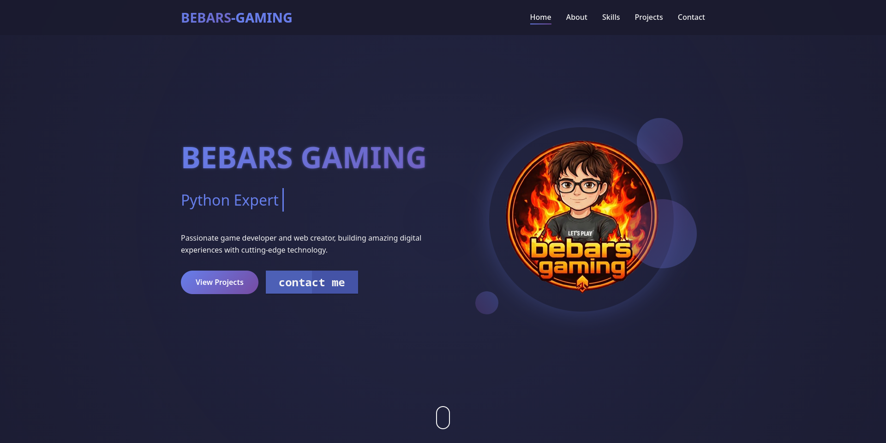

# BEBARS-GAMING Portfolio

[](https://bebarsstudio-cmd.github.io)
[](https://firebase.google.com)
[](LICENSE)

A modern, responsive portfolio website for BEBARS-GAMING, featuring a complete admin panel, real-time voting system, feedback collection, and multi-admin support with Firebase + JSON backup.



## 🌟 Features

### 🎨 Frontend
- **Modern Design** - Gradient colors, smooth animations, and glass morphism effects
- **Fully Responsive** - Works perfectly on desktop, tablet, and mobile devices
- **Typing Animation** - Dynamic text animation showcasing roles
- **Parallax Effects** - Mouse-following shapes for depth
- **Smooth Scrolling** - Seamless navigation between sections
- **Reveal Animations** - Elements fade in as you scroll

### 📰 News System
- **Real-time News Feed** - Latest updates displayed on homepage
- **Admin Controls** - Add, edit, and delete news posts
- **Categories** - Announcement, Release, Upcoming, General
- **Author Tracking** - Shows which admin posted each news item

### 👥 Multi-Admin System
- **Two Default Admins**:
  - `bebars` / `bebarsstudio@gmail.com` (Super Admin)
  - `ahmed` / `ahmed@example.com` (Admin)
- **Role-Based Permissions**:
  - **Super Admin**: Can add/delete/reset any admin
  - **Admin**: Can only manage content
- **Admin Management**:
  - Add new admins
  - Delete existing admins
  - Reset passwords
- **Session Persistence** - Stay logged in after page refresh

### ⚔️ VS Section (Bebars vs Ahmed)
- **Interactive Voting** - Users can vote for their favorite
- **Real-time Updates** - Live like counter with progress bar
- **Vote Limiting** - One vote per user per day
- **Percentage Display** - Visual representation of votes
- **Heart Animation** - Animated feedback on vote

### 📧 Feedback System
- **Form Validation** - Real-time validation of all fields
- **Feedback Types** - Bug reports, feature suggestions, improvements, general
- **Optional URL Attachment** - Helps debug issues
- **Email Integration** - Sends feedback via EmailJS
- **Local Backup** - Saves to localStorage if email fails

### 💾 Database System
- **Firebase Integration** - Cloud storage with real-time sync
- **Automatic Fallback** - Uses local JSON files when Firebase is unavailable
- **Data Persistence** - News, projects, skills, and likes are saved
- **Backup Notification** - Shows when running in offline mode

### 📁 Data Structure
- **JSON Files** - All data stored in `data/` folder:
  - `admins.json` - Admin accounts
  - `news.json` - Default news backup
  - `projects.json` - Projects data
  - `skills.json` - Skills and stats

## 🛠️ Technologies Used

| Technology | Purpose |
|------------|---------|
| **HTML5** | Structure and semantics |
| **CSS3** | Styling, animations, responsive design |
| **JavaScript** | Interactivity and DOM manipulation |
| **Firebase** | Cloud database and authentication |
| **EmailJS** | Email sending for feedback |
| **Font Awesome** | Icons and social media links |
| **Google Fonts** | Poppins font family |

## 📂 Project Structure
bebarsstudio-cmd.github.io/
├── index.html # Main HTML file
├── css/
│ └── style.css # All styles and animations
├── js/
│ ├── database.js # Firebase operations & admin management
│ └── script.js # UI interactions & animations
├── data/
│ ├── admins.json # Admin accounts (default)
│ ├── news.json # Default news backup
│ ├── projects.json # Default projects backup
│ └── skills.json # Default skills backup
├── images/
│ ├── Bebars.png # Bebars avatar
│ ├── ahmed.png # Ahmed avatar
│ ├── portofolio.png # Portfolio preview
│ ├── soon.png # Default project image
│ └── favicon.png # Site icon
└── README.md # Documentation

text

## 🚀 Installation & Setup

### Prerequisites
- A GitHub account
- (Optional) Firebase account for cloud database
- (Optional) EmailJS account for feedback email

### Step 1: Clone the Repository
```bash
git clone https://github.com/bebarsstudio-cmd/bebarsstudio-cmd.github.io.git
cd bebarsstudio-cmd.github.io